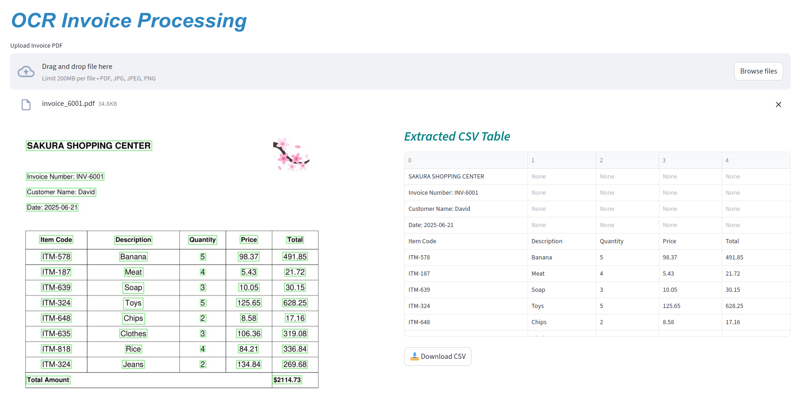
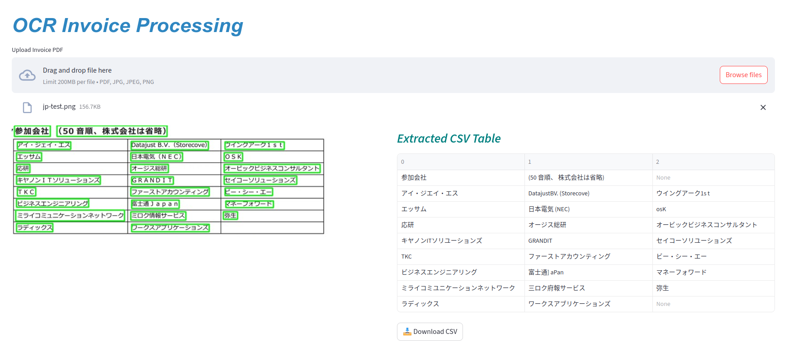

# Document processing OCR APP

- This repository contains a sample app that extract and recognize texts from input document using EasyOCR library. The input can be PDF or image type. 
- The app can detect **English** and **Japanese** text. The sample invoice files are given in 'data' folder for testing. 
- The detected texts were saved as .csv file that will be applied for automatic data entry in future.


## Environment Setup

```bash
conda env create --name doc_ocr python=3.10 
conda activate doc_ocr
pip install -r requirements.txt
```

## Usage

```bash
streamlit run app.py
```

- The visualized files and output csv files are saved in 'outputs' folder.





